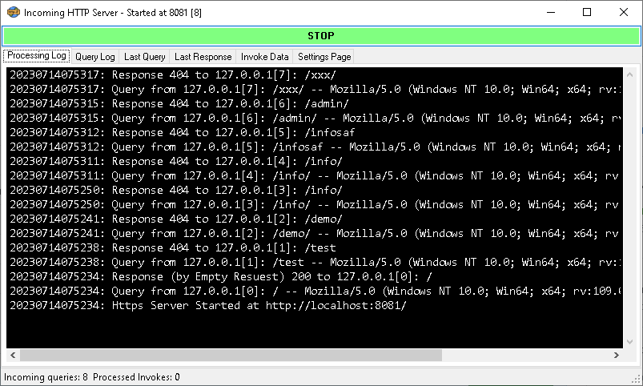
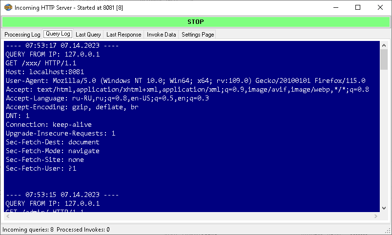
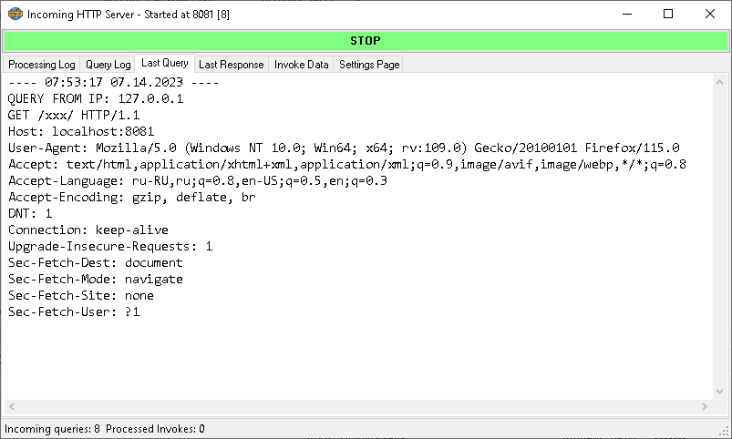
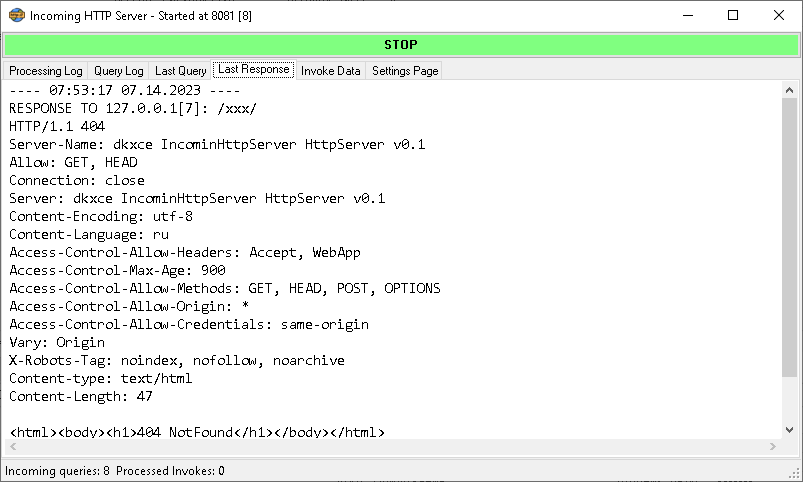
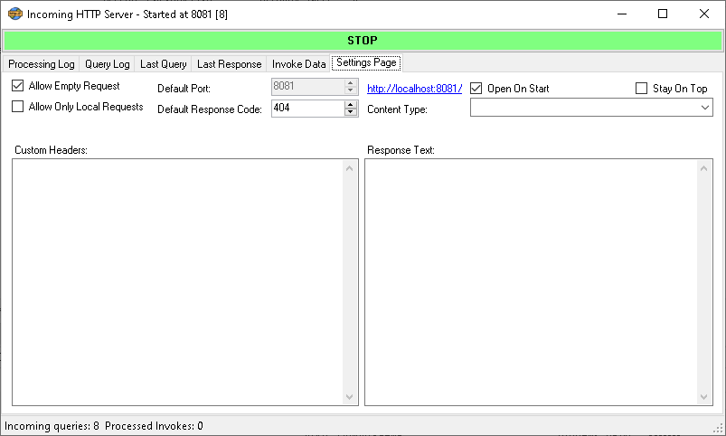

# IncominHttpServer

Http Server for callbacks and dump incoming requests.    

Solution to view dump of incoming http requests for analyze and logging.    
DDNS Client for [freedns.afraid.org](https://freedns.afraid.org/) and [ydns.io](https://ydns.io/) (Manual and Automatic Update Hosts Entries).    

Утилита для просмотра и дампа входящих запросов на HTTP сервер.    
Предназначена для просмотра параметров входящих запросов для callback-процедур от облачных сервисов.    
DDNS Клиент для [freedns.afraid.org](https://freedns.afraid.org/) и [ydns.io](https://ydns.io/) (обновление имен в автоматическом и ручном режимах).    

**UPDATES**:    
--------
**rls2 v1.0.2.0**:    
- Added Automatic Update DDNS Entries Support (each 15 minutes if need)
- Added Tray Icon (DYN DNS, 3 colors)
- Added Create Shortcuts (Desktop, Start Menu, Startup)
- Added Tray Notify (on Automatic Update Hosts Entries and Fails)
--------
        
        
        
        
        
